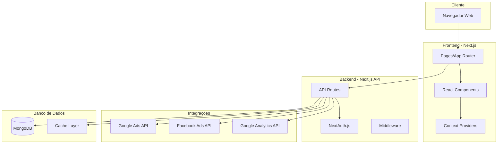

# Arquitetura do NineTwoDash

## Visão Geral da Arquitetura

O NineTwoDash é construído usando uma arquitetura moderna de aplicação web full-stack, aproveitando o Next.js 15 como framework principal. A aplicação segue os princípios de separação de responsabilidades, modularidade e escalabilidade.



## Componentes Principais

### 1. Frontend (Cliente)

#### App Router Structure
```
src/app/
├── (auth)/
│   └── login/          # Autenticação
├── admin/              # Área administrativa
│   ├── dashboard/      # Dashboard principal
│   ├── clients/        # Gestão de clientes
│   ├── integracoes/    # Configuração de APIs
│   └── ...            # Outras páginas admin
├── portal/[clientId]/  # Portal do cliente
│   ├── dashboard/      # Dashboard do cliente
│   ├── campanhas/      # Campanhas ativas
│   └── ...            # Outras páginas do portal
└── api/               # API Routes
```

#### Componentes React
- **UI Components**: Biblioteca de componentes base usando Radix UI
- **Business Components**: Componentes específicos do domínio
- **Layout Components**: Estruturas de página reutilizáveis

#### State Management
- **Context API**: Para estado global (tema, autenticação)
- **React Hooks**: Para estado local dos componentes
- **SWR/React Query**: Para cache de dados da API (futuro)

### 2. Backend (Servidor)

#### API Routes
Organizadas por domínio de negócio:

```
src/app/api/
├── auth/               # Autenticação
├── admin/              # Endpoints administrativos
├── dashboard/          # Dados do dashboard
├── campaigns/          # Gestão de campanhas
├── analytics/          # Dados de analytics
├── google-ads/         # Integração Google Ads
├── facebook-ads/       # Integração Facebook Ads
└── reports/           # Geração de relatórios
```

#### Middleware
- **Authentication**: Verificação de sessão em rotas protegidas
- **Rate Limiting**: Controle de requisições (a implementar)
- **Error Handling**: Tratamento centralizado de erros

#### Segurança
- **Encryption**: AES-256 para credenciais sensíveis
- **JWT Sessions**: Tokens seguros com expiração
- **CORS**: Configuração adequada para produção
- **Input Validation**: Validação em todas as entradas

### 3. Banco de Dados

#### MongoDB Schema Design

**Collections Principais:**
- `users`: Usuários do sistema
- `clients`: Clientes da agência
- `campaigns`: Dados de campanhas
- `reports`: Relatórios gerados
- `analyticsdata`: Cache de dados do GA4
- `activitylogs`: Logs de auditoria

#### Índices e Performance
```javascript
// Índices otimizados para queries comuns
ClientSchema.index({ slug: 1 }); // Busca por slug
CampaignSchema.index({ clientId: 1, platform: 1 });
ReportSchema.index({ clientId: 1, createdAt: -1 });
```

### 4. Integrações Externas

#### Google Ads API
- **Autenticação**: OAuth2 com refresh token
- **Rate Limiting**: Respeita limites da API
- **Error Handling**: Retry com backoff exponencial

#### Facebook Ads API
- **Autenticação**: Access token de longa duração
- **Versioning**: Suporte a múltiplas versões da API
- **Batch Requests**: Otimização de chamadas

#### Google Analytics 4
- **Data API**: Acesso a métricas em tempo real
- **Sampling**: Tratamento de dados amostrados
- **Custom Dimensions**: Suporte a dimensões personalizadas

## Fluxos de Dados

### 1. Fluxo de Autenticação
```
1. Usuário envia credenciais
2. NextAuth valida contra MongoDB
3. Gera JWT com role e permissões
4. Cliente armazena token
5. Requisições incluem token
6. Middleware valida token
```

### 2. Fluxo de Dados de Campanhas
```
1. Cron job ou trigger manual
2. API Route busca credenciais criptografadas
3. Descriptografa credenciais
4. Chama APIs externas (Google/Facebook)
5. Processa e normaliza dados
6. Salva no MongoDB
7. Invalida cache se necessário
8. Retorna dados atualizados
```

### 3. Fluxo de Geração de Relatórios
```
1. Usuário solicita relatório
2. Sistema agrega dados do período
3. Calcula métricas derivadas
4. Gera visualizações
5. Salva relatório no banco
6. Envia notificação (opcional)
```

## Padrões de Design

### 1. Repository Pattern
Abstração de acesso a dados:
```typescript
// Exemplo: ClientRepository
class ClientRepository {
  async findBySlug(slug: string) { }
  async create(data: ClientData) { }
  async update(id: string, data: Partial<ClientData>) { }
}
```

### 2. Service Layer
Lógica de negócio isolada:
```typescript
// Exemplo: CampaignService
class CampaignService {
  async syncCampaigns(clientId: string) { }
  async calculateROAS(campaign: Campaign) { }
}
```

### 3. Factory Pattern
Criação de integrações:
```typescript
// Exemplo: IntegrationFactory
class IntegrationFactory {
  static create(platform: 'google' | 'facebook') {
    // Retorna a implementação correta
  }
}
```

## Escalabilidade

### Horizontal Scaling
- **Stateless Design**: Aplicação sem estado no servidor
- **Database Scaling**: MongoDB replica sets
- **CDN**: Assets estáticos via CDN

### Vertical Scaling
- **Code Splitting**: Carregamento sob demanda
- **Image Optimization**: Next.js Image component
- **API Optimization**: Paginação e filtros

### Caching Strategy
- **Browser Cache**: Assets estáticos
- **API Cache**: Respostas frequentes
- **Database Cache**: Queries complexas
- **CDN Cache**: Conteúdo global

## Monitoramento e Observabilidade

### Logging
- **Application Logs**: Winston/Pino (a implementar)
- **Error Tracking**: Sentry (a implementar)
- **Performance Monitoring**: New Relic/DataDog (a implementar)

### Métricas
- **API Response Time**: Latência das requisições
- **Database Performance**: Queries lentas
- **External API Health**: Status das integrações
- **User Analytics**: Comportamento dos usuários

## Segurança em Profundidade

### Camadas de Segurança
1. **Network**: HTTPS, firewall
2. **Application**: Input validation, CSRF protection
3. **Session**: Secure cookies, JWT validation
4. **Data**: Encryption at rest and in transit
5. **Access Control**: RBAC implementation

### Compliance
- **LGPD**: Proteção de dados pessoais
- **PCI DSS**: Se processar pagamentos
- **SOC 2**: Controles de segurança

## Deploy e DevOps

### CI/CD Pipeline
```yaml
# Exemplo de pipeline
stages:
  - test
  - build
  - deploy

test:
  - npm run test
  - npm run lint

build:
  - npm run build
  - docker build

deploy:
  - deploy to staging
  - run e2e tests
  - deploy to production
```

### Infraestrutura
- **Containerização**: Docker para consistência
- **Orquestração**: Kubernetes (opcional)
- **Monitoramento**: Prometheus + Grafana
- **Backup**: Automated MongoDB backups

## Considerações Futuras

### Melhorias Planejadas
1. **Real-time Updates**: WebSockets para dados ao vivo
2. **Machine Learning**: Predições e insights automáticos
3. **Mobile App**: Aplicativo React Native
4. **Multi-tenant**: Suporte a múltiplas agências
5. **Webhook System**: Notificações em tempo real

### Débito Técnico
1. **Testes**: Aumentar cobertura de testes
2. **Documentação**: API documentation (Swagger)
3. **Performance**: Otimização de queries
4. **Refactoring**: Modularização de componentes grandes

## Conclusão

A arquitetura do NineTwoDash foi projetada para ser modular, escalável e segura. Seguindo os princípios de clean architecture e aproveitando as capacidades do Next.js 15, o sistema está preparado para crescer e evoluir conforme as necessidades do negócio.